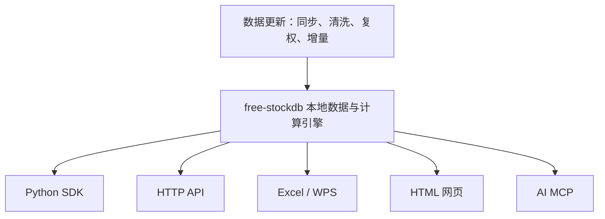

# free-stockdb

## 本地量化数据引擎

面向 A 股日K、分钟K与 ETF 分钟、tick级数据的本地量化引擎。free-stockdb 将数据同步、清洗、复权、组织为可直接用于批量查询、批量计算研究的数据底座。

**❤️双击更新 -> 双击启动 -> 直接调用。**

数据本地落盘，研究不再依赖远程接口。

| 本地优先 | 增量同步 | 数据支持(按需) | 本地指标计算 | 五种调用方式 |
|---|---|---|---|---|
| 数据在用户磁盘 | 只处理变化数据 | 日/周/月/1/5/15/30分钟/tick | 39 种指标、5 种指数 | Python / HTTP / Excel / HTML / MCP |



同步后的查询、计算、回测和接口都使用本机数据，不与远程请求链路耦合。

## 为什么需要本地数据引擎

全市场批量回测的瓶颈不是策略代码，而是数据工程。以全市场 7000+ 股票分钟线回测为例，远程 API 方案的真实工作量：

| 环节 | 在线 API 方案的真实耗时 | free-stockdb |
|---|---|---|
| 数据下载 | 全市场分钟数据逐股请求，受限频/积分/IP 风控约束，实测需要**3-5 天**；爬虫方案批量拉取封号/限频 | 通过 `sync_url.txt` 配置数据源，Zstd 压缩传输，增量同步，断点续传 |
| 数据清洗 | 处理停牌、退市、代码变更、缺失补拉、时间排序，**1-2 天** | 同步流程自动完成 |
| 复权处理 | 获取分红送转数据、推算复权因子、历史回刷，**1-2 天** | 内置完整复权因子，查询时写时计算 |
| 存储设计 | 选型数据库、设计表结构、建索引、批量入库、优化查询，**1-3 天** | 定制 C++ 时序引擎，开箱即用 |
| 指标计算 | 编写 MA/MACD/KDJ 等公式、pandas 全市场遍历极慢（单次数小时），**2-3 天** | 内置 39 指标 + 5 指数，Rust 计算核心比 pandas 快 3 倍，**数秒完成** |
| 板块映射 | 爬取概念/行业数据、构建双向索引、持续维护，**1-2 天** | 内置申万一二三级 + 1200 概念板块，`bk.get()` 毫秒查询 |
| 接口对接 | Python/HTTP/Excel/AI 各自对接维护，**1-2 天** | 五种调用方式统一内置 |
| **合计** | **最少 10-15 个工作日才能跑通第一个全市场策略** | **30 分钟内从零到可运行** |

远程 API 方案在全市场回测场景下不是慢，是跑不通。free-stockdb 将数据工程与策略研究完整解耦：数据更新在同步层完成，策略只读本地数据集，数据源可替换，研究接口不变。

## 已集成的数据工程

| 使用者原本需要维护 | 启动后直接获得 |
|---|---|
| 接口 Token、限频、封ip、断点恢复和全市场数据调度 | 数据源增量同步、文件校验和本地存量数据 |
| 新股、停牌、退市、代码变更、时间排序与历史修正 | 统一的数据组织、复权因子与查询协议 |
| 数据库选型、表结构、索引、批量入库和查询优化 | 本地 C++ 时序数据服务，按代码和时间范围批量读取 |
| pandas/DataFrame 拼接、指标滚动计算与中间缓存 | `zb.get()` 批量指标和指数计算接口 |
| Python、HTTP、Excel、网页、AI 工具的多套对接 | 一套本地协议对应 Python SDK、HTTP API、Excel/WPS、HTML、MCP |

数据完成同步后，查询、计算和回测只依赖本地数据集；更新与研究彼此独立。

## 两分钟开始

Windows 使用者可从 [Releases](../../releases) 下载发行包。首次运行：

```text
1. 运行数据更新工具
2. 数据同步到 ./data
3. 启动 stockdb (仅2.2mb)
4. 直接使用 Python、HTTP、Excel/WPS、网页或 MCP 查询本机数据
```

已有数据完整落盘在 `./data`；后续更新只处理变化数据，离线时仍可继续查询、回测和计算。

## 数据存储与数据源

历史数据采用 Zstd 压缩，不按未压缩记录体积占用磁盘，比csv/mysql小3倍以上。首次同步从配置的数据源获取历史数据，后续只更新增量，不走逐股、逐页的远程 API 拉取流程。

默认数据集聚焦高频行情与复权，底层数据库支持任意自定义数据存储，低频率数据：财报、宏观、资金流等可按需要接入同一套本地查询与计算引擎。

## 核心能力

### 本地全市场数据运行时

- 日线、周线、月线，以及 1/5/15/30 分钟 K 线，tick级数据(按需)
- 价格、成交量、成交额、换手率、估值、市值、ST 等常用字段
- 前复权、后复权、不复权和原始复权因子查询
- 股票、ETF、行业和概念板块的组织与双向查询
- 本地存储、无远程查询延迟，研究和回测不受远程 API 并发配额影响
- 可配置局域网服务，多人协作、分布式回测。

### 批量查询与计算

```python
result = get_data(
    code=7000_codes,         # 7000+ 股票 / ETF
    start=any_start,              # 任意时间周期
    end=any_end,
    frequency=any_frequency,# 分钟 / 日 / 周 / 月
    fq=any_fq,                      # 前复权 / 后复权 / 不复权
    fields=any_fields,          # 任意单多字段筛选
    as_df=False/True          # 返回list、dict、 DataFrame
)
```

```python
result = zb.get(
    name="ma,kdj,macd,....",      # 39指标 / 5种指数计算
    codes=7000_codes,        # 单股 / 批量 / 全市场
    start=any_start,        # 任意时间范围
    end=any_end,
    frequency=any_frequency, # 分钟 / 日 / 周 / 月
    fq=any_fq,               # 前复权 / 后复权 / 不复权
    n=["5,10,20", None, "12,26,9"],  # 每个指标独立参数
    cross="with_value"       # 原始指标 / 金叉信号 / 二者同时返回
)
```

```python
result = bk.get(
    x=code_or_board_or_codes,   # 股票代码 / 板块名称或代码 / 批量股票
    category=0-3,                      # 概念板块 / 申万一级 / 申万二级 / 申万三级
    fields="code,name,symbols" # 任意单多字段筛选
)
```

`get_data()` 面向全市场、长周期和字段筛选；`zb.get()` 面向 39 种技术指标和 5 种指数计算；`bk.get()` 用于股票与行业/概念板块的双向映射。数据和计算始终在本机服务侧完成，避免研究代码反复把全市场数据搬运到远程 API 或临时 DataFrame 中。股票优化查询器rd.get/keys/vals()支持区间a>b，正则*，排序，截取[:num]，遍历，类SQL查询。

**内置 39 种技术指标：**

| 类别 | 指标 |
|---|---|
| 趋势类 | MA、EMA、SMA、WMA、DMA、EXPMA、TRIX、DMI、DFMA、BBI |
| 震荡类 | MACD、KDJ、RSI、WR、CCI、PSY、BIAS、ROC、MTM、DPO |
| 通道类 | BOLL、KTN、TAQ |
| 量价类 | OBV、VR、EMV、MFI、CR、MASS |
| 综合类 | ATR、ASI、BRAR、XSII、STD、SUM、HHV、LLV、REF |

**5 种指数计算方法（zhishu）：** 等权、流通市值加权、成交额加权、成交量加权、总市值加权

### 五种调用方式

| 调用方式 | 适用场景 |
|---|---|
| Python SDK | 回测、研究和策略开发（同步 `get_data()` / 异步 `get_data_async()`） |
| HTTP API | 任意语言与本地系统集成（`http://127.0.0.1:7899/?cmd=get&t=...`） |
| Excel / WPS 宏 | 表格分析、选股和办公自动化 |
| HTML 页面 | 无代码查看、筛选和浏览本地行情数据 |
| AI MCP | Claude、Cursor、Windsurf 等支持 MCP 协议的 AI 工具直接查询、计算和分析本地数据 |

MCP 协议为自实现，无需额外安装 MCP SDK。AI 工具通过 MCP 连接后可直接调用 `get_data()`、`zb.get()`、`bk.get()` 查询本地行情、计算指标和分析板块。

调用示例位于 `调用方式/`。

## 数据源可控与长期使用

数据源是输入，不是产品的唯一依赖。你可以：

- 在 `sync_url.txt` 切换到自己的同步节点、内网服务器或网络共享目录。
- 用 `file://` 或本地目录离线同步已归档的数据快照。
- 通过本地写入接口接入其他行情来源，补充或更新自有数据。
- 保留本地数据快照，在任何没有外网、没有 Token 的环境中继续查询与回测。

因此，数据源服务的可用性变化不会让已同步的研究数据失效；更换输入源也不要求替换本地查询、计算和调用层。

## 数据质量与复权

本地数据保留不复权行情与复权因子，查询时可按需要返回前复权、后复权或不复权结果。可通过本地接口抽样检查复权因子、价格、成交量和公司行为日期；使用者也可以用自己认可的数据源生成或校验本地数据。

## 硬件与存储要求

| 项目 | 最低配置 | 推荐配置 |
|---|---|---|
| 磁盘空间 | 约 5GB（仅日线） | 约 20GB（含全量分钟线） |
| 内存 | 2GB | 8GB+ |
| 操作系统 | Windows 7+ | Windows 10+ |

数据采用 Zstd 压缩存储，实际磁盘占用远小于同等 CSV/MySQL 方案。

## 本地网络与安全行为

- 服务默认监听 `127.0.0.1:7899`，不会主动暴露到公网。
- 同步器只访问 `sync_url.txt` 或 `--source` 指定的地址；配置为空时不会发起同步请求。
- 同步文件在写入前校验清单中的 SHA-256 与大小；公共同步节点应使用 HTTPS。
- 发布包应从 Releases 下载并核对对应版本提供的 SHA-256。

## 源码与构建

`cpp/` 包含本地服务、同步器、客户端计算示例和 CMake 构建定义；`sync_url.txt` 和调用协议均公开。构建 C++ 组件需要 CMake 3.14+、C++17 编译器、libcurl 和 OpenSSL 开发包。Windows 用户可直接使用 Releases 中的预编译发行包，无需自行编译。

```bash
cmake -S cpp -B cpp/build
cmake --build cpp/build --config Release
```

🚀️ **更新与运行示例**

 


## 许可证与免责声明

本仓库适用 [项目许可证](LICENSE)。数据版权、使用授权和再分发条件由各数据源及其权利人决定；使用者应自行确认数据源条款。

本项目用于软件学习、数据管理与量化研究，不构成投资建议。任何数据完整性、及时性和交易决策风险均应由使用者独立评估。

